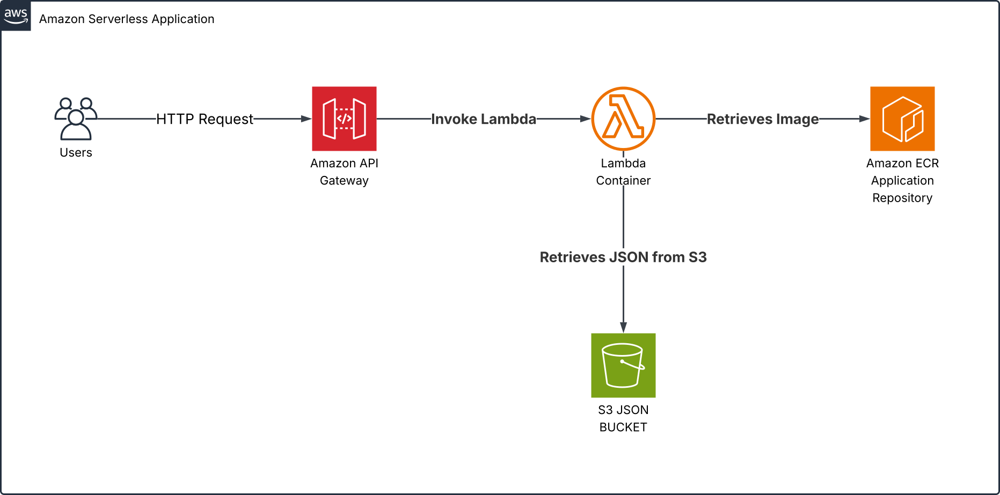

[](http://156.193.84.39:8090/job/konecta-cicd/)

<sub>Jenkins pipeline (`Jenkinsfile`) runs the a different pipeline that deploys on AWS on every push, using a webhook.</sub>

<sub>GitHub Actions workflow (`.github/workflows/ci.yml`) runs the same checks defined in `ci.sh` on every push. (Currently disabled in favor of Jenkins)</sub>

# Konecta CICD Project

We were tasked with dockerizing a node.js application to track team members availability. This project attempts to fix the issue where previously data was lost when containers were stopped or removed.

I made 2 pipelines to tackle this issue with similarities in between:

1. Local Pipeline:
   - A full local CI/CD bash script pipeline was included, using ESLint, Prettier, Jest, Trivy, and docker compose
   - Uses docker volumes for postgresql to ensure data persistence
   - The same pipeline is mirrored on Github Actions (proof of concept)
   - The image is finally pushed to Docker hub
2. Jenkins Pipeline:
   - The full production pipeline that shares all the formatting and linting of the local version
   - Uses AWS S3 to store `output/history.json` to ensure data persistence
   - Runs on my local Jenkins server, invoked by the git push webhook
   - Applies Terraform to deploy the infrastructure on AWS
   - The application is pushed to ECR and deployed on AWS Lambda as a container
   - AWS API Gateway fronts the application to trigger the Lambda

---

## Project Setup

1. Clone the repo:

   ```bash
   git clone https://github.com/gimmeursocks/konecta-cicd-project/
   cd konecta-cicd-project
   ```

   - `.gitignore` file was added to exclude large or unwanted files

2. Install dependencies for local development:

   ```bash
   npm install
   ```

3. Fill in the `.env.example`, then rename it to `.env`:

   ```bash
   IMAGE_NAME=your-username/your-image
   IMAGE_TAG=latest

   APP_PORT=3000
   S3_BUCKET=your-s3-bucket-name
   AWS_REGION=your-aws-region

   # Local development with postgres and dockerhub
   DOCKER_USER=your_dockerhub_username
   DOCKER_PASS=your_dockerhub_password

   POSTGRES_PORT=5432
   POSTGRES_USER=postgres
   POSTGRES_PASSWORD=postgres
   ```

4. Either develop locally using `ci.sh` or `ci.yml`, or deploy on AWS using `Jenkinsfile`, If the AWS deployment is used, then make sure to setup IAM users with correct permissions, and to fill the `terraform.tfvars` with your data

   ```terraform-vars
   aws_account_id = "your-account-id"
   aws_region     = "your-aws-region"
   image_tag 	   = "lambda-image-tag"
   ```

---

## Continuous Integration Script (ci.sh)

This script automates the development workflow:

```bash
#!/bin/bash
set -euo pipefail # Exit immediately if any command fails

# load docker environment variables securely
set -o allexport; source .env; set +o allexport

echo "Starting CI process..."

echo "Linting code with ESLint..."
npx eslint . --max-warnings 0

echo "Formatting code with Prettier..."
npx prettier --check .

echo "Running Tests with Jest..."
npm run devtest

echo "Building Docker image..."
docker compose build

echo "Scanning image with Trivy..."
# only show vulnerabilities if found
trivy image \
  --exit-code 1 \
  --quiet \
  --skip-version-check \
  --ignore-unfixed \
  --severity HIGH,CRITICAL \
  --format json "${IMAGE_NAME}:${IMAGE_TAG}" |
  jq '.Results[] | select(.Vulnerabilities | length > 0)'

echo "Pushing image to Docker Hub..."
echo "$DOCKER_PASS" | docker login -u "$DOCKER_USER" --password-stdin
docker push "${IMAGE_NAME}:${IMAGE_TAG}"

echo "Starting containers and stopping old ones..."
docker compose down || true
docker compose up -d

echo "CI process completed successfully."
```

#### How to run the script

```bash
bash ci.sh
```

##### It will:

1. Lint and format code
2. Run tests
3. Build docker images
4. Scan for vulnerabilities with trivy
5. Push the image to docker hub
6. Start the container locally with docker compose

---

## Dockerfile

The application is dockerized for portability and data persistence using Docker volumes

Key points:

1. Base image: `node:22-alpine` (over 85% reduction in size 390 MB -> 55 MB)
2. Non root user access for security
3. Uses `.dockerignore` to skip unwanted files

```dockerfile
FROM node:22-alpine

WORKDIR /app

# Copy package files
COPY package*.json ./

# Install all dependencies (excluding dev dependencies)
RUN npm ci --omit=dev && npm cache clean --force

# Copy source code
COPY . .

# Best practice to use a non-root user
RUN addgroup -S app && adduser -S app -G app && \
    chown -R app:app /app
USER app

# Expose the port
EXPOSE 3000

# Run the application
CMD ["node", "server.js"]
```

---

## Docker Compose

`docker-compose.yml` orchestrates the app and postgreSQL service:

```yaml
services:
  app:
    build: .
    image: "${IMAGE_NAME}:${IMAGE_TAG}"
    ports:
      - "${APP_PORT}:${APP_PORT}"
    environment:
      APP_PORT: ${APP_PORT}
      POSTGRES_PORT: ${POSTGRES_PORT}
      POSTGRES_USER: ${POSTGRES_USER}
      POSTGRES_PASSWORD: ${POSTGRES_PASSWORD}
    depends_on:
      - postgres

  postgres:
    image: postgres:alpine
    ports:
      - "${POSTGRES_PORT}:5432"
    environment:
      POSTGRES_USER: ${POSTGRES_USER}
      POSTGRES_PASSWORD: ${POSTGRES_PASSWORD}
    volumes:
      - pgdata:/var/lib/postgresql/data

volumes:
  pgdata:
```

- Volumes persist database data between container restarts
- Depends_on ensures postgres starts before the app does

---

## Validating the Pipeline

1. Run the CI script

2. Verify that:
   - ESLint and Prettier run without any errors
   - All tests pass `npm test`
   - Trivy vulnerability scan returned nothing
   - Image push to docker hub was successful
   - Docker builds successfully
   - App is accessible through `http://localhost:3000`
3. Check that postgreSQL data persists after stopping containers:

   ```bash
   docker compose down
   docker compose up -d
   ```

   - Data in pgdata should persist and remain intact.

---

## Github Actions workflow

`.github/workflows/ci.yaml` runs the same checks as `ci.sh` but on every push, uses the Github secrets as an online .env file

```bash
name: CI

on:
  push:
    branches: [main]
  pull_request:

env:
  IMAGE_NAME: ${{ secrets.IMAGE_NAME }}
  DOCKER_USER: ${{ secrets.DOCKER_USER }}
  DOCKER_PASS: ${{ secrets.DOCKER_PASS }}
  APP_PORT: 3000
  POSTGRES_PORT: 5432
  POSTGRES_USER: ${{ secrets.POSTGRES_USER }}
  POSTGRES_PASSWORD: ${{ secrets.POSTGRES_PASSWORD }}

jobs:
  build:
    runs-on: ubuntu-latest

    steps:
      - name: Checkout
        uses: actions/checkout@v4

      - name: Set up Node
        uses: actions/setup-node@v4
        with:
          node-version: "22"

      - name: Short commit
        run: echo "IMAGE_TAG=${GITHUB_SHA::7}" >> $GITHUB_ENV

      - name: Install dependencies
        run: npm ci

      - name: Lint with ESLint
        run: npx eslint . --max-warnings 0

      - name: Check formatting with Prettier
        run: npx prettier --check .

      - name: Run tests with Jest
        run: npm run devtest

      - name: Set up Docker Buildx
        uses: docker/setup-buildx-action@v3

      - name: Build Docker image
        run: docker compose build
        env:
          IMAGE_NAME: ${{ env.IMAGE_NAME }}
          IMAGE_TAG: ${{ env.IMAGE_TAG }}

      - name: Install Trivy
        run: |
          curl -sfL https://raw.githubusercontent.com/aquasecurity/trivy/main/contrib/install.sh | sh
          sudo mv ./bin/trivy /usr/local/bin/trivy

      - name: Scan image with Trivy
        run: |
          trivy image \
            --exit-code 1 \
            --quiet \
            --skip-version-check \
            --ignore-unfixed \
            --severity HIGH,CRITICAL \
            --format json "${IMAGE_NAME}:${IMAGE_TAG}" |
          jq '.Results[] | select(.Vulnerabilities | length > 0)'

      - name: Log in to Docker Hub
        uses: docker/login-action@v3
        with:
          username: ${{ env.DOCKER_USER }}
          password: ${{ env.DOCKER_PASS }}

      - name: Push Docker image
        run: docker push "${IMAGE_NAME}:${IMAGE_TAG}"

      - name: Start containers
        run: |
          docker compose down || true
          docker compose up -d
```

---

## Jenkins setup

#### Installation

- Installed Jenkins natively on my local machine, with basic default plugins
- Configured the `jenkins` user in the `docker` group to allow Jenkins to talk with the Docker daemon

#### Configure public access

For testing purposes I exposed my local Jenkins to the public internet so that Github's webhook will be able to reach it:

- Home network + Port forwarding (my setup)
  - Forwarded port 8090 on my home router to the Jenkins server
  - Accessed through `http://<my-public-ip>:8090/`
  - Pros: It is simple and persistent as long as my machine is up
  - Cons: Works only at home and requires keeping the machine up, and to be mindful of security

- Temporary tunnel (alternative)
  - Tools like ngrok, cloudflared tunnel, etc.. create a temporary public URL that can be forwarded to my local Jenkins server
  - Pros: No need for static IP or router access, works anywhere
  - Cons: URL is temporary and the webhook has to be modified every time it changes

---

## Jenkins deployment

`Jenkinsfile` runs a different pipeline from `ci.sh`, now it is deployed on AWS

Key points:

1. Runs natively on my machine
2. Is invoked by a webhook through a Github push
3. Utilizes Jenkins credential management for secrets

| Credential ID     | Type              | Used For                                     |
| ----------------- | ----------------- | -------------------------------------------- |
| `docker-creds`    | Username/Password | Docker Hub push                              |
| `aws-creds`       | AWS Credentials   | AWS User for Jenkins Push to ECR             |
| `terraform-creds` | AWS Credentials   | AWS User for Terraform to allow provisioning |

```groovy
pipeline {
    agent any
    environment {
        IMAGE_NAME = 'gimmeursocks/konecta-cicd-project'
        // use the short commit hash from the GitHub webhook as the tag
        IMAGE_TAG = "${env.GIT_COMMIT.take(7)}"
        APP_PORT = '3000'
        AWS_DEFAULT_REGION = 'eu-central-1'
        AWS_ACCOUNT_ID = '328986589640'
        ECR_URI = "${AWS_ACCOUNT_ID}.dkr.ecr.${AWS_DEFAULT_REGION}.amazonaws.com"
    }
    stages {
        stage('Install Dependencies') {
            steps {
                sh 'npm ci'
            }
        }
        stage('Lint') {
            steps {
                sh 'npx eslint . --max-warnings 0'
            }
        }
        stage('Prettier Check') {
            steps {
                sh 'npx prettier --check .'
            }
        }
        stage('Test') {
            steps {
                sh 'npm test'
            }
        }
        stage('Build Docker Image') {
            steps {
                sh 'docker build -f Dockerfile.lambda -t ${IMAGE_NAME}:${IMAGE_TAG} .'
            }
        }
        stage('Security Scan with Trivy') {
            steps {
                sh '''
                trivy image \
                  --exit-code 1 \
                  --quiet \
                  --skip-version-check \
                  --ignore-unfixed \
                  --severity HIGH,CRITICAL \
                  --format json "${IMAGE_NAME}:${IMAGE_TAG}" |
                  jq '.Results[] | select(.Vulnerabilities | length > 0)'
              '''
            }
        }
        stage('Setup ECR Infrastructure') {
            steps {
                withCredentials([[ $class: 'AmazonWebServicesCredentialsBinding', credentialsId: 'terraform-creds']]){
                    sh '''
                      cd terraform
                      terraform init
                      terraform apply -var="aws_account_id=${AWS_ACCOUNT_ID}" -target=module.ecr_repo -auto-approve
                    '''
                    script {
                      def ecrUrl = sh(returnStdout: true, script: "cd terraform && terraform output -raw ecr_repository_url").trim()
                      env.ECR_URL = ecrUrl
                    }
                }
            }
        }
        stage('Authenticate to ECR') {
            steps {
                withCredentials([[ $class: 'AmazonWebServicesCredentialsBinding', credentialsId: 'aws-creds']]){
                    sh '''
                      aws ecr get-login-password --region ${AWS_DEFAULT_REGION} \
                        | docker login --username AWS --password-stdin ${ECR_URI}
                    '''
                }
            }
        }
        stage('Push to ECR') {
            steps {
                sh '''
                  docker tag ${IMAGE_NAME}:${IMAGE_TAG} ${ECR_URL}:${IMAGE_TAG}
                  docker push ${ECR_URL}:${IMAGE_TAG}
                '''
            }
        }
        stage('Deploy Infrastructure') {
            steps {
                withCredentials([[ $class: 'AmazonWebServicesCredentialsBinding', credentialsId: 'terraform-creds']]){
                    sh '''
                      cd terraform
                      terraform apply -var="aws_account_id=${AWS_ACCOUNT_ID}" -var="image_tag=${IMAGE_TAG}" -auto-approve
                    '''
                    script {
                      def apiUrl = sh(returnStdout: true, script: "cd terraform && terraform output -raw api_endpoint").trim()
                      env.API_URL = apiUrl
                    }
                }
            }
        }
        stage('Test API Gateway Endpoint') {
            steps {
                script {
                    echo "API Gateway URL: ${API_URL}"
                    // Wait for a few seconds to ensure the deployment is complete
                    sleep 10
                    def response = sh(script: "curl -s -o /dev/null -w '%{http_code}' ${API_URL}", returnStdout: true).trim()
                    if (response == '200') {
                        echo 'API Gateway is reachable and returned status code 200.'
                    } else {
                        error "API Gateway test failed with status code ${response}."
                    }
                }
            }
        }
    }
    post {
        always {
            echo 'CI process completed.'
        }
        failure {
            echo 'CI process failed!'
        }
    }
}
```

---

## Terraform Provisioning

Terraform manages all AWS infrastructure for this project in a modular way.

**Key modules**:

- ECR Module: Creates a private repository for the Docker images
- S3 Module: Provides a bucket to store `output/history.json` for persistent data
- Lambda Module: Deploys the Node.js container as a Lambda function, giving it IAM roles to read/write from S3
- API Gateway Module: Exposes a public endpoint to invoke the Lambda function

**Workflow Highlights**:

1. Terraform applies the ECR module first (`-target=module.ecr_repo`) to ensure the repository exists
2. The container image is pushed to ECR
3. Terraform then applies the Lambda and API Gateway modules, referencing the image tag with current Github commit hash
4. All infrastructure is fully described as modular code, making it reproducible and version-controlled

This modular setup simplifies CI/CD integration, allowing Jenkins to deploy without manual intervention.

---

## AWS Architecture



**Components Overview:**

1. API Gateway – Publicly accessible HTTP endpoint that triggers Lambda
2. Lambda (Container Image) – Stateless serverless container running Node.js
3. S3 Bucket – Persistent JSON storage for application data
4. ECR Repository – Stores Docker images used by Lambda, has less latency than using Docker hub
5. IAM – Granular permissions for:
   - Lambda to read/write from S3
   - Jenkins to read/write from ECR
   - Terraform to provision infra

This architecture achieves the following:

1. Decouples compute from storage, benefiting from serverless scaling
2. Avoids the need for an always-on EC2 or container host, which massively reduces the cost
3. Allows scaling down to zero, reducing costs for infrequent usage

---

## Infrastructure Choice Reasoning

I chose **AWS Lambda + API Gateway + S3** over alternatives like App Runner, ECS Fargate, or GCP Cloud Run for the following reasons:

| Option                 | Pros                                                                                           | Cons / Why Not Chosen                                                                                                                 |
| ---------------------- | :--------------------------------------------------------------------------------------------- | ------------------------------------------------------------------------------------------------------------------------------------- |
| **Lambda (container)** | - Serverless, auto-scales to zero<br/>- No idle costs<br/>- Easy S3 integration                | - Cold start latency (~2s for this app), but suitable for infrequent workloads (like this app)<br/>- Limited execution time of 15 min |
| **ECS Fargate**        | - Full container orchestration<br/>- Can run long processes<br/>- Serverless with auto scaling | - Higher cost if container is always on<br/>- More complex to setup scaling to zero                                                   |
| **App Runner**         | - Simplified container deployment<br/>- HTTPS endpoint baked in<br/>- Auto scaling             | - Higher cost for small workloads<br/>- Less fine-grained control because it is a simpler interface on top of ECS Fargate             |
| **GCP Cloud Run**      | - Similar to Lambda/App Runner<br/>- Scales to zero<br/>- Supports container images            | - Cold start latency (~5s+)<br/>- Limited execution time of 60 min<br/>- More familiarity with AWS                                    |

**Rationale:**

- The workload is infrequent (a small DevOps team, occasional writes). Lambda’s pay-per-call model reduces costs immensely
- S3 provides persistent storage without managing a database, suitable for the current simple JSON file
- Using Lambda + API Gateway + S3 ensures no infrastructure maintenance, automatic scaling, and cost efficiency, while still supporting containerized Node.js images efficiently
- ECS or App Runner would incur higher costs for idle containers and add unnecessary orchestration complexity

---

## Pre-commit Hook for Auto-Formatting

To keep the codebase clean and consistent, we use a Git pre-commit hook that runs formatters automatically before each commit:

1. Install Husky

   ```bash
   npm install --save-dev husky
   npx husky init
   ```

2. Create the hook

   ```bash
   cat <<EOF > .husky/pre-commit
   terraform fmt -recursive
   npm run format
   git add .
   EOF
   ```

3. Format script
   In `package.json`:

   ```json
   "scripts": {
     "format": "npx prettier --write ."
   }
   ```

Now every `git commit` will automatically format files with Prettier, and .tf files with `terraform fmt` before the commit is finalized, the CI steps are still kept for errors that might slip through the cracks.

---

## Common Issues & Fixes

| Issue                                       | Symptom / Error                                                                               | Fix                                                                                                                                                            |
| ------------------------------------------- | --------------------------------------------------------------------------------------------- | -------------------------------------------------------------------------------------------------------------------------------------------------------------- |
| **Port 5432 already in use**                | `bind: address already in use` when starting PostgreSQL container                             | I had a local PostgreSQL service running. Stopped it (`sudo systemctl stop postgresql`).                                                                       |
| **Jenkins can’t access Docker daemon**      | Build steps fail with `permission denied while trying to connect to the Docker daemon socket` | Added the `jenkins` user to the `docker` group and restarted Jenkins: `sudo usermod -aG docker jenkins && sudo systemctl restart jenkins`.                     |
| **GitHub webhook not triggering**           | No Jenkins job scheduled after a successful trigger                                           | Double check webhook URL (`http://<my-public-ip>:8090/github-webhook/`), repository webhook settings, and make sure the server is reachable from the internet. |
| **Jenkins getting access denied**           | Jenkins doesn't have permission to push to ECR/run terraform                                  | Ensure credentials are setup correctly, and IAM users are made for Jenkins and Terraform.                                                                      |
| **Black screen when accessing API Gateway** | `Service Unavailable` when accessing the api gateway url                                      | Make sure that the lambda is setup correctly, and that you have given the application sometime to initialize (10s)                                             |
| **No data shown in front end**              | Front end has no tables only save button                                                      | Ensure Lambda has the right permission to access S3, check cloudwatch logs for more info and to check S3 access logs for any blocked access                    |
